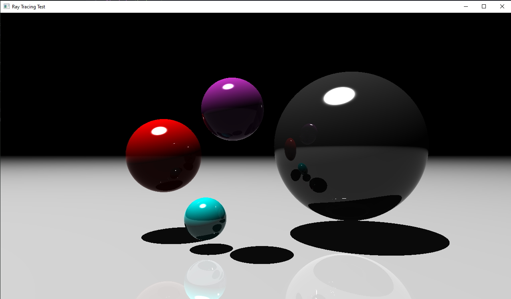
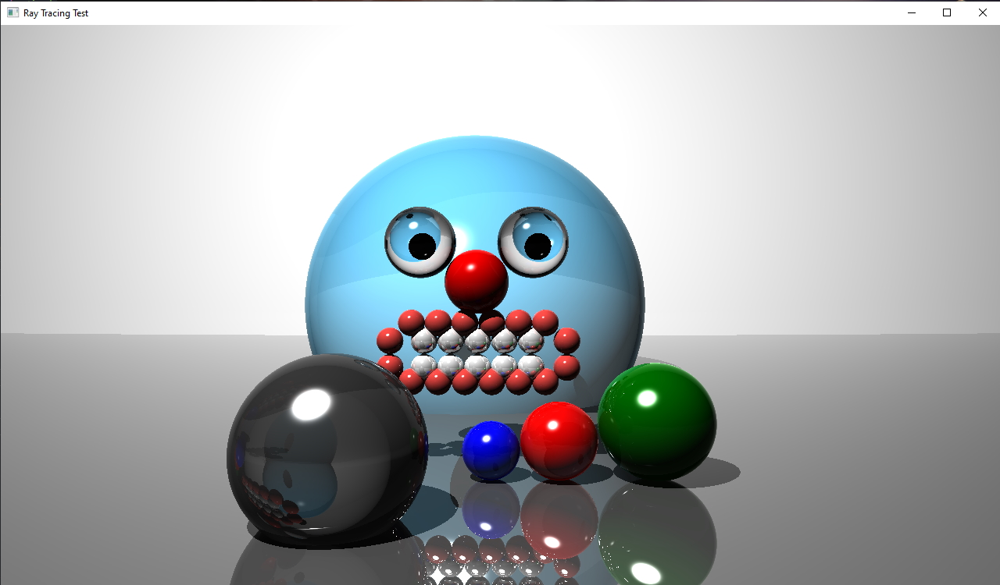

**Requires OpenGL**

Ray Tracer by Paolo Sy-Quia
||CMPT 361 Fall 2019||

Instructions:
Run ./rayT (scene number)

Example "./rayT 3" to render scene 3

Scenes:
1. specular and diffuse
2. reflections and shadows
3. refraction (with index of refraction 1.5)
4. large number of spheres with various combinations of diffuse, specular, reflection, and refraction effects to form a face with:
  1. refractive eyes
  1. reflective teeth
5. an alternate scene 4 with less objects

